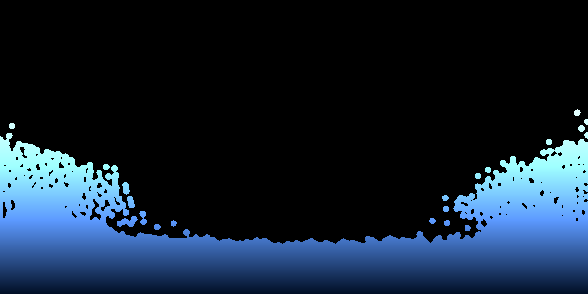

# SPH Water Simulation

A simple (unoptimized) implementation of  the 'Smooth Particle Hydrodynamics' method for water simulation in C++.

## References

* [Particle-Based Fluid Simulation for Interactive Applications](http://matthias-mueller-fischer.ch/publications/sca03.pdf) by M.Müller, D.Charypar and M.Gross

## Used Libraries

* [SFML](http://www.sfml-dev.org/):  Simple and Fast Multimedia Library

--

